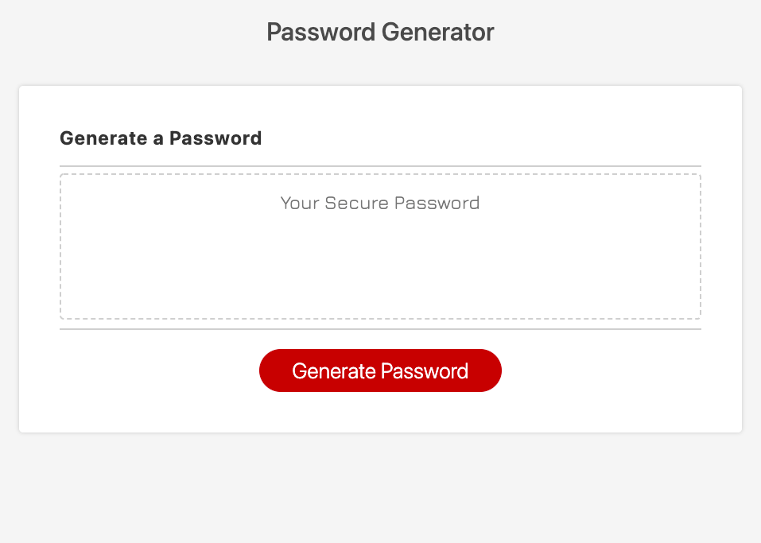

# hw3-passwordGenerator

## Link to website
[Click here for the website generator!](https://jsoomie.github.io/hw3-passwordGenerator/ "Password Generator")

## Webpage info

A website that generates a password with a series of prompts that goes through criterias of the user's choosing. 

The minimum length of the password is 8 characters and the maximum is 128 characters. Then the user can choose to include lowercase letters, uppercase letters, numerics and/or special characters. 

When the user chooses a length not defined or inputs non numericals, the user is alerted with an error message. 

If the user goes through the prompts like normal, then the password should print inside of the textbox with a randomly generated password that adheres to the user's preference. 

There hasn't been any errors showing in the console log or none to my findings as of yet. 

## Webpage screenshot

